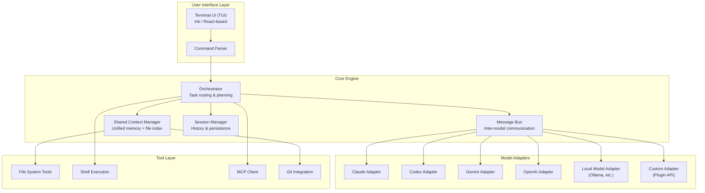

# Unified AI Terminal — Project Plan

## The Vision

A single, open-source terminal interface where multiple AI models (Claude, Codex, Gemini, and more) share the same brain. Instead of juggling separate terminals, you load one interface — models see each other's work, talk to each other, and orchestrate plans together. A multiplexer for AI minds.

---

## 1. Naming

> [!IMPORTANT]
> The names **Nexus**, **Loom**, **Mux**, **Hivemind**, and **Quorum** are all heavily saturated on GitHub. The names below are vetted for uniqueness and availability.

### Top Picks

| Name | Rationale | Vibe |
|:---|:---|:---|
| **Patchwork** | Multiple AI "patches" stitched into one fabric. Evokes open-source quilting culture. Distinctive, searchable. | Warm, collaborative, dev-friendly |
| **Ganglion** | A cluster of nerve cells that acts as a relay center. Perfect metaphor — your terminal is the nerve cluster connecting AI brains. | Technical, precise, memorable |
| **Manifold** | A mathematical surface where multiple dimensions meet. Models converge in one space. | Clean, intellectual, scalable brand |
| **Crosswire** | Models are cross-wired — connected and sharing signals. Terminal as a switchboard. | Edgy, action-oriented |
| **Ether** | The medium through which all models communicate. Invisible, universal, connecting. | Minimal, elegant, slightly mystical |

### My Recommendation: **Manifold**

- ✅ Not taken as an AI terminal tool
- ✅ Clean, professional, not cringey
- ✅ Scales as a brand (`manifold run`, `manifold connect`, `manifold sync`)
- ✅ The mathematical meaning (a space where many dimensions meet) perfectly captures the concept
- ✅ Easy to type, easy to say, easy to remember
- ✅ Works for npm package name: `@manifold-ai/cli` or `manifold-term`

> [!NOTE]
> **Runner up: Ganglion** — more distinctive and has zero conflicts, but slightly harder to spell. **Patchwork** is the friendliest option if you want a warmer brand.

---

## 2. Competitive Landscape

Before building, here's what already exists and where the gap is:

| Tool | What it does | What it lacks |
|:---|:---|:---|
| **Warp** | Terminal emulator with AI features, can run multiple agents | Agents don't share context; no inter-model communication |
| **Aider** | AI pair programmer, multi-model support | Single-model-at-a-time; no orchestration |
| **Conductor** | Multi-agent orchestration via git worktrees | macOS only; agents are isolated, not collaborative |
| **Quorum CLI** | Multi-agent debates between LLMs | Discussion-only; not a coding terminal |
| **OpenCode** | Terminal AI coding agent, 75+ providers | Single model per session; no shared brain |
| **Goose** | On-machine AI agent with MCP | Single agent; no multi-model orchestration |

### The Gap (Our Opportunity)

**Nobody has built a terminal where multiple AI models actively share context, see each other's work, and can delegate tasks to each other in real-time.** Every existing tool either:
1. Runs one model at a time, or
2. Runs multiple models in isolation (separate contexts)

**Manifold** fills this gap by making AI models **first-class collaborators** in a shared workspace.

---

## 3. Architecture



### Key Design Decisions

#### Shared Context Manager
The brain. All models read from and write to the same context:
- **File Index**: Vector-embedded index of the current workspace
- **Conversation Memory**: A shared log of all model interactions, summaries, and decisions
- **Project State**: Current task tree, completed work, pending items
- **Rules & Constraints**: Shared coding standards, architecture decisions

#### Message Bus
How models talk to each other:
- Model A can **ask** Model B a question
- Model A can **delegate** a subtask to Model B
- Models can **vote** on approaches (consensus mode)
- The orchestrator can **broadcast** context updates to all models

#### Model Adapters (Plugin System)
Each model gets a thin adapter that translates between Manifold's internal protocol and the model's API:
```
ManifoldMessage → Adapter → Model API → Response → Adapter → ManifoldMessage
```
Adapters handle: authentication, rate limiting, context window sizing, tool-call translation.

---

## 4. Tech Stack

| Layer | Technology | Rationale |
|:---|:---|:---|
| **Language** | TypeScript | Accessible for contributors, strong typing, async-native, rich npm ecosystem |
| **Terminal UI** | Ink (React for CLI) | Component-based TUI, familiar paradigm, great for complex layouts |
| **Build** | tsup / esbuild | Fast builds, single-file output for distribution |
| **Package Manager** | pnpm | Fast, disk-efficient, monorepo-friendly |
| **Monorepo** | Turborepo | Parallel builds, caching, scales well |
| **Testing** | Vitest | Fast, TypeScript-native, Jest-compatible |
| **Model Communication** | REST/SDK + Streaming | Direct API calls with SSE/WebSocket streaming |
| **Context Storage** | SQLite (via better-sqlite3) | Portable, zero-config, fast local storage |
| **Vector Search** | Vectra (local) | Lightweight vector DB for file indexing, no external deps |
| **CLI Framework** | Commander.js | Battle-tested, auto-help generation |
| **Config** | TOML (via @iarna/toml) | Human-readable, widely adopted in dev tools |

---

## 5. Repository Structure

```
manifold/
├── .github/
│   ├── workflows/
│   │   ├── ci.yml                  # Lint, test, build on PRs
│   │   ├── release.yml             # Automated npm publish + GH releases
│   │   └── nightly.yml             # Nightly integration tests
│   ├── ISSUE_TEMPLATE/
│   │   ├── bug_report.md
│   │   ├── feature_request.md
│   │   └── adapter_request.md      # Request support for a new model
│   ├── PULL_REQUEST_TEMPLATE.md
│   └── CODEOWNERS
│
├── packages/
│   ├── core/                       # @manifold/core
│   │   ├── src/
│   │   │   ├── orchestrator/       # Task routing, planning, delegation
│   │   │   ├── context/            # Shared context manager
│   │   │   ├── message-bus/        # Inter-model communication
│   │   │   ├── session/            # Session management & persistence
│   │   │   ├── tools/              # Built-in tools (fs, shell, git)
│   │   │   └── index.ts
│   │   ├── package.json
│   │   └── tsconfig.json
│   │
│   ├── cli/                        # @manifold/cli (the main entry point)
│   │   ├── src/
│   │   │   ├── commands/           # CLI commands (run, config, status)
│   │   │   ├── ui/                 # Ink components (TUI)
│   │   │   │   ├── App.tsx
│   │   │   │   ├── ChatPane.tsx
│   │   │   │   ├── ModelStatus.tsx
│   │   │   │   ├── TaskTree.tsx
│   │   │   │   └── ContextPanel.tsx
│   │   │   ├── config/             # Config loading (TOML)
│   │   │   └── index.ts
│   │   ├── package.json
│   │   └── tsconfig.json
│   │
│   ├── adapters/                   # Model adapters (one per model)
│   │   ├── claude/                  # @manifold/adapter-claude
│   │   │   ├── src/
│   │   │   │   ├── client.ts       # Anthropic API client
│   │   │   │   ├── adapter.ts      # ManifoldAdapter implementation
│   │   │   │   └── index.ts
│   │   │   └── package.json
│   │   ├── codex/                   # @manifold/adapter-codex
│   │   │   ├── src/
│   │   │   │   ├── client.ts
│   │   │   │   ├── adapter.ts
│   │   │   │   └── index.ts
│   │   │   └── package.json
│   │   ├── gemini/                  # @manifold/adapter-gemini
│   │   │   ├── src/
│   │   │   │   ├── client.ts
│   │   │   │   ├── adapter.ts
│   │   │   │   └── index.ts
│   │   │   └── package.json
│   │   ├── openai/                  # @manifold/adapter-openai
│   │   │   └── ...
│   │   └── ollama/                  # @manifold/adapter-ollama
│   │       └── ...
│   │
│   └── sdk/                        # @manifold/sdk (for building custom adapters)
│       ├── src/
│       │   ├── types.ts            # Core type definitions
│       │   ├── adapter.ts          # Base adapter class
│       │   ├── message.ts          # Message protocol types
│       │   └── index.ts
│       └── package.json
│
├── docs/
│   ├── getting-started.md
│   ├── architecture.md
│   ├── adapters.md                 # How to build custom adapters
│   ├── configuration.md
│   ├── orchestration.md            # How models collaborate
│   └── contributing.md
│
├── examples/
│   ├── basic-chat/                 # Simple multi-model chat
│   ├── code-review/                # Claude reviews, Gemini implements
│   └── research-agent/             # Models divide research tasks
│
├── manifold.toml.example           # Example user config
├── package.json                    # Root workspace config
├── pnpm-workspace.yaml
├── turbo.json
├── tsconfig.base.json
├── LICENSE                         # MIT
├── README.md
├── CHANGELOG.md
├── CONTRIBUTING.md
├── CODE_OF_CONDUCT.md
└── SECURITY.md
```

---

## 6. Core Concepts

### 6.1 The Shared Brain

When a user starts a Manifold session, the system creates a **Shared Context** that all connected models can read:

```toml
# manifold.toml — User configuration
[project]
name = "my-app"
path = "."

[models.claude]
role = "architect"        # Handles planning and code review
api_key_env = "ANTHROPIC_API_KEY"
model = "claude-sonnet-4"

[models.gemini]
role = "implementer"      # Handles code generation
api_key_env = "GEMINI_API_KEY"
model = "gemini-2.5-pro"

[models.codex]
role = "executor"          # Handles running and testing code
api_key_env = "OPENAI_API_KEY"
model = "codex-mini"

[orchestration]
mode = "collaborative"     # Models work together on tasks
context_sharing = true     # All models see each other's output
auto_delegate = true       # Orchestrator can auto-assign tasks
```

### 6.2 Orchestration Modes

| Mode | Description |
|:---|:---|
| **Solo** | Single model, traditional chat experience |
| **Collaborative** | All models share context, user directs who does what |
| **Autonomous** | Orchestrator auto-routes tasks to the best model for each job |
| **Consensus** | Models discuss and vote on approaches before executing |
| **Pipeline** | Tasks flow through models in sequence (plan → implement → review) |

### 6.3 Inter-Model Communication Protocol

```typescript
interface ManifoldMessage {
  id: string;
  from: string;           // Model ID or "user" or "orchestrator"
  to: string | "all";     // Target model or broadcast
  type: "query" | "response" | "delegate" | "broadcast" | "vote";
  content: string;
  context: ContextSlice;  // Relevant subset of shared context
  metadata: {
    task_id?: string;
    priority?: number;
    requires_response?: boolean;
  };
}
```

---

## 7. Phased Roadmap

### Phase 1: Foundation (Weeks 1-4)
- [x] Create GitHub repo with monorepo structure
- [ ] Implement `@manifold/sdk` — types, base adapter, message protocol
- [ ] Implement `@manifold/core` — basic orchestrator, context manager, session manager
- [ ] Build first adapter: `@manifold/adapter-claude`
- [ ] Basic CLI with Ink TUI — single model chat
- [ ] TOML config loading
- [ ] File system tools (read, write, list)

### Phase 2: Multi-Model (Weeks 5-8)
- [ ] Implement `@manifold/adapter-gemini` and `@manifold/adapter-codex`
- [ ] Message bus for inter-model communication
- [ ] Shared context manager with file indexing
- [ ] "Collaborative" orchestration mode
- [ ] Split-pane TUI (see multiple model outputs)
- [ ] Git integration

### Phase 3: Intelligence (Weeks 9-12)
- [ ] "Autonomous" orchestration mode with task routing
- [ ] "Consensus" mode — models vote on approaches
- [ ] "Pipeline" mode — sequential model chains
- [ ] MCP client integration
- [ ] Vector search for workspace context
- [ ] Session persistence and resumption

### Phase 4: Ecosystem (Weeks 13-16)
- [ ] Plugin API for custom adapters
- [ ] `@manifold/adapter-openai` and `@manifold/adapter-ollama`
- [ ] Web dashboard (optional companion)
- [ ] Telemetry (opt-in, privacy-first)
- [ ] npm publish automation
- [ ] Community adapter template

### Phase 5: Scale (Ongoing)
- [ ] Remote collaboration (shared sessions)
- [ ] Team workspaces
- [ ] Adapter marketplace
- [ ] Performance optimization (Rust rewrite of hot paths)
- [ ] VS Code / IDE extensions

---

## 8. What Makes This Different

| Principle | Implementation |
|:---|:---|
| **Shared Brain** | All models read/write the same context. No information silos. |
| **Models as Teammates** | Models can ask each other questions, delegate, and review each other's work. |
| **Model-Agnostic** | Clean adapter API means any model can plug in. |
| **Open Source First** | MIT license, community adapters, transparent roadmap. |
| **Developer UX** | Beautiful TUI, sensible defaults, zero-friction setup. |
| **Scalable Architecture** | Monorepo, plugin system, designed for global community contributions. |

---

## 9. Next Steps

> [!IMPORTANT]
> **Decision needed from you:**
> 1. **Name** — Do you like **Manifold**, or prefer one of the alternatives (Ganglion, Patchwork, Crosswire, Ether)?
> 2. **GitHub org** — Create under your personal account or a new GitHub org?
> 3. **License** — MIT (recommended for maximum adoption) or something else?
> 4. **First model** — Which adapter should we build first? (Recommendation: Claude, since you're already using it)

Once you decide, I'll:
1. Initialize the monorepo with the full structure above
2. Create the GitHub repo with README, LICENSE, and CI/CD
3. Scaffold `@manifold/sdk`, `@manifold/core`, and the first adapter
4. Build the basic TUI
